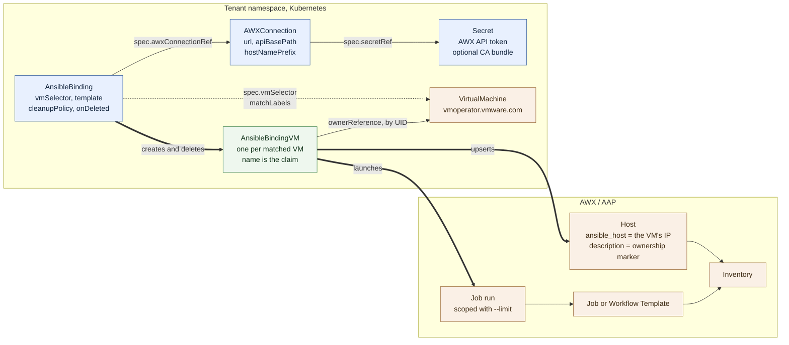
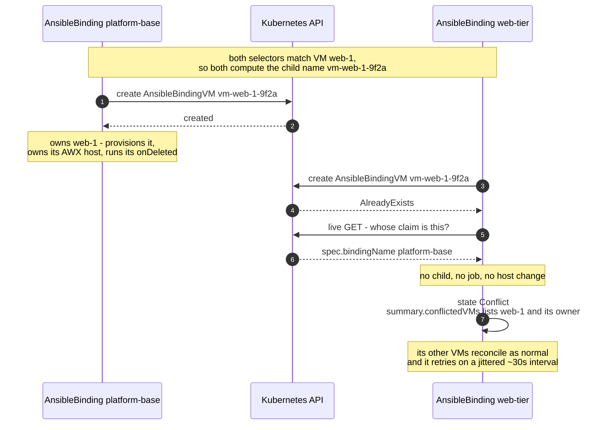
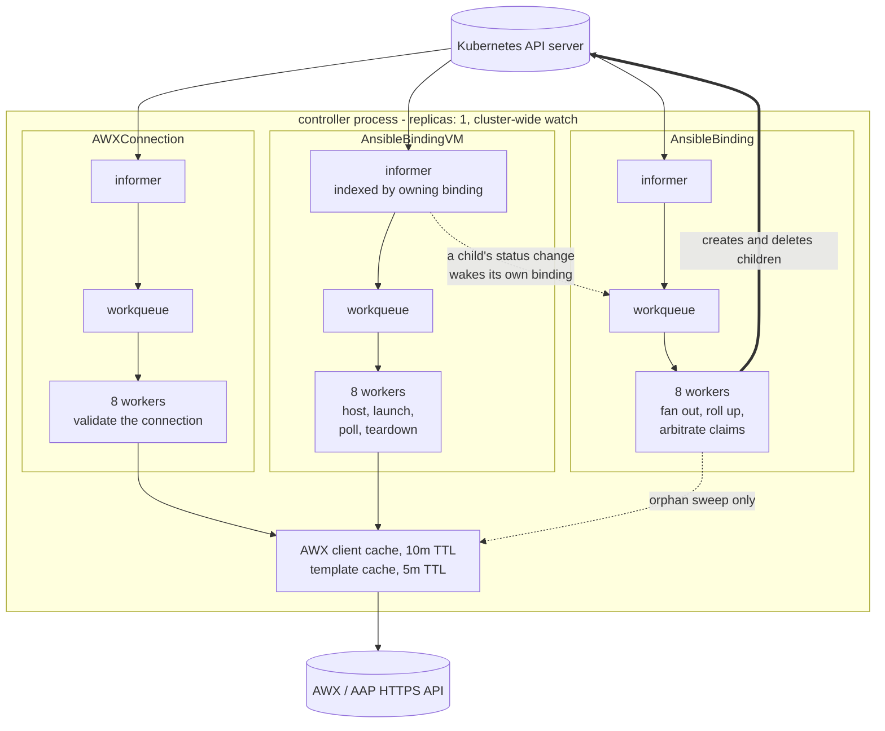

# Architecture

How the pieces fit together. The [README](README.md) says what the CRDs are and [Scenarios](SCENARIOS.md) walks through what the controller does with them; this page is the shape underneath both - which object owns which, what the process looks like while it runs, and where each piece of state actually lives.

- [The objects](#the-objects)
- [Who owns what](#who-owns-what)
- [The claim](#the-claim)
- [The process](#the-process)
- [Where state lives](#where-state-lives)
- [Deliberate limits](#deliberate-limits)

## The objects

Three CRDs, all namespace-scoped, plus the `VirtualMachine`s they select and the AWX objects they reach out to. You write two of them; the controller writes the third.

Blue is what you write, green is what the controller writes, tan is what it finds or creates elsewhere.

Two edges carry most of the design:

**`AnsibleBinding` → `AnsibleBindingVM`** is a fan-out, not a reference. The binding creates one child per matched VM and copies its spec down into each - a copy rather than a pointer, because a child has to be able to finalize after its parent is already gone. That is what keeps the binding's own pass O(1) in AWX requests however many VMs match, and lets the children reconcile in parallel across workers.

**`AnsibleBindingVM` → `VirtualMachine`** is an `ownerReference`, so a deleted VM takes its child with it through ordinary garbage collection, with no help from the binding. The reference is by UID, which is what stops a VM deleted and recreated under the same name inheriting the old one's child.

Everything that touches AWX - upserting a host, launching a job, polling it, deleting the host - happens on a child. The binding's only direct AWX work is the rare [orphan sweep](SCENARIOS.md#a-host-leaks-because-the-controller-was-killed-mid-cleanup).

## Who owns what

| Object | Created by | Deleted by | Finalizer | What its finalizer does |
|---|---|---|---|---|
| `Secret` | you | you | none | - |
| `AWXConnection` | you | you | none | nothing outside Kubernetes to clean up |
| `AnsibleBinding` | you | you | `ansible-binding-cleanup` | deletes its children, then waits - confirmed by a live list - until every one has finished |
| `AnsibleBindingVM` | the binding | the garbage collector, when its VM goes; the binding, when the VM stops matching | `ansible-binding-vm-cleanup` | runs `onDeleted` if the VM is genuinely gone, then removes the AWX host |
| AWX `Host` | a child, or adopted if it already existed | that child's finalizer, unless adopted or `cleanupPolicy: Retain` | - | - |

The ordering that matters: a binding's finalizer cannot release until each child's has, and a child's cannot release until its AWX host is gone or deliberately kept. That is what makes `kubectl delete ansiblebinding` a real teardown rather than a detach - and why deleting the service while bindings still exist wedges them ([uninstall notes](README.md#uninstalling)).

## The claim

Only one `AnsibleBinding` may own a `VirtualMachine`. There is no lock, no lease and no claim CRD: the child's **name** is the claim, and Kubernetes' own name uniqueness is the arbitration.

A child is named `vm-<vm name>-<hash of the full VM name>`, from the VM alone - never from the binding. So every binding that selects a given VM computes the same name for it, and only one `create` can win.

Three details make it hold:

**The cache cannot grant ownership.** A cache miss is not proof a VM is free, so the create is always attempted, and `AlreadyExists` is answered with a **live** read rather than assuming the object found is one of its own from an earlier pass.

**Identity is checked, not inferred.** `spec.vmName`, `spec.bindingName` and `spec.bindingUID` are immutable in the schema, and the child's `ownerReference` must name its own VM. A hand-written child under a different name is refused rather than reconciled, so nothing can talk its way into launching playbooks that nothing would clean up. `bindingUID` is why a binding deleted and recreated under the same name claims its VMs afresh instead of inheriting a live claim.

**The claim is held through cleanup.** It is free only once the owning child's finalizer has finished - `onDeleted` hook included. A VM replaced under the same name therefore waits for its predecessor's teardown before the replacement can be claimed, which is exactly the ordering an AWX host keyed to that name needs.

The trade is that the name scheme changed, so [upgrading needs a drain](README.md#upgrading-to-the-next-release) - the controller refuses to start while children from the older, per-binding naming still exist.

## The process

One Deployment, one replica, watching cluster-wide. Each CRD gets its own informer, its own workqueue and its own pool of workers.

What the shape buys:

**`VirtualMachine`s are read, never cached.** There is deliberately no VM informer - caching every VM on the Supervisor would cost memory proportional to the whole cluster. A binding lists the VMs its selector matches on each pass, and a child reads its own VM from the API server. The cost is latency: a VM that starts matching is picked up within `resync_period` rather than instantly.

**A child's status change wakes its binding, and nothing else.** The child informer is indexed by owning binding, so a rollup is recomputed from the cache without listing anything. Bindings *waiting* on a claim are not woken by another binding's child - that would be a namespace-wide fanout on every status write - which is why a conflicted binding polls on its own jittered interval instead.

**Writes are batched and bounded.** A binding collects every child write it wants, then issues them in parallel batches that double from 1 up to 32 concurrent, capped at 500 writes per pass with the remainder carried to the next. Starting at one keeps a systematic failure - a webhook rejecting everything, exhausted quota - cheap. Deletes go before creates so exhausted quota cannot deadlock.

**AWX is talked to on a timer, not on every pass.** The client and its detected API base path are cached for 10 minutes; a resolved template for 5. The launch path deliberately bypasses the template cache and re-reads from AWX every time, because `ask_limit_on_launch` can be switched off in the UI between passes and a stale copy of that flag is the difference between one host and a whole inventory. In a steady state the AWX traffic is one request per VM per `host_check_period`, plus one per binding per orphan sweep.

## Where state lives

Nothing that matters is held in process memory. Everything a restart needs is derivable from an object.

| State | Lives in | Why there |
|---|---|---|
| Which VM a binding owns | the child's **name**, in etcd | the name is the claim; anything softer could grant two owners |
| Which binding owns an AWX host | the host's **description** in AWX | AWX hosts have no labels, and the marker has to survive a binding being deleted and recreated |
| What a VM last ran | the child's `appliedGeneration` / `appliedTrigger` | per VM, so a re-run requested while one VM is mid-job is queued rather than swallowed |
| Whether a run is in flight | the child's `lastJobID` + `awxEndpoint` | the fingerprint stops a repointed connection following a job number to an unrelated job |
| How far a teardown has got | the child's `status.deprovision` | a hook resumes across restarts instead of relaunching a decommission playbook |
| When the host was last checked | the child's `lastHostCheck` | a restart must not reset every VM's timer and stampede AWX |
| When hosts were last swept | the binding's `lastOrphanScan` | same reason, one binding at a time |
| What a teardown did, after the child is gone | an Event on the `AnsibleBinding` | the child takes its status with it; the Event is what an operator finds afterwards |

The one thing genuinely not recorded is the instant between AWX accepting a launch and the job id reaching status - which is why execution is at-least-once and playbooks are expected to be idempotent ([FAQ](FAQ.md#can-a-playbook-run-twice-for-one-request)).

## Deliberate limits

- **One replica, no leader election.** The work is IO-bound against AWX and already parallel across 8 workers per resource; a second replica would need leader election to avoid two controllers launching the same job, and buys nothing until that is the bottleneck.
- **One binding per VM.** Two bindings on one machine would mean two unordered AWX runs against it, two claims on one inventory host and two teardown playbooks. Several playbooks for one VM belong in one AWX workflow ([FAQ](FAQ.md#can-two-bindings-target-the-same-vm)).
- **No workflow introspection.** The controller resolves the top-level template and nothing else. What a workflow's nodes target, which inventories they use and in what order they run is AWX's business.
- **The controller never reaches a VM.** It talks to the Kubernetes API and to AWX's HTTPS API only. AWX does the SSH, so the Supervisor needs no route into a workload network.
- **`onDeleted` cannot reach the guest.** vm-operator destroys the machine during its own finalization, before anything here runs, and both routes to an earlier hook are closed to a Carvel-packaged service. The hook is for the external record ([FAQ](FAQ.md#can-i-run-a-playbook-when-a-vm-is-deleted)).
